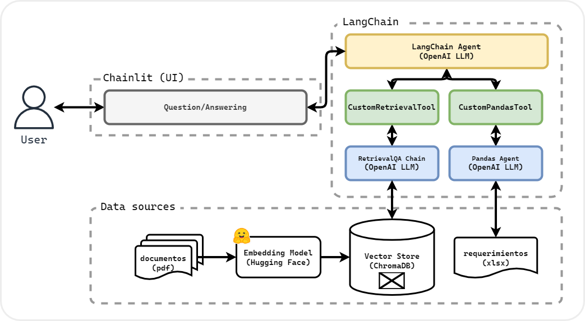

# Sara (Sistema de atención para requerimientos de abastecimiento)

Sara es un asistente virtual que te permite resolver dudas en torno a la radicación y consulta de estado de requerimientos a la cadena de abastecimiento.

## Ejecución
1. Crear y activar ambiente virtual.

   ```bash
   python -m venv .venv
   ```

   ```bash
   .venv/Scripts/activate
   ```
2. Instalar dependencias.
   ```bash
   pip install -r requirements.txt
   ```
3. Para crear la vector store será necesario colocar los documentos `pdf` dentro de una carpeta llamada `pdf` en la raíz del proyecto. 
<br>Del mismo modo, crear una carpeta llamada `data`, y en ella guardar un `.xlsx` con la tabla de requerimientos. Finalmente deberá ejecutar:
   ```bash
   python utils/create_vector_store.py
   ```
4. Ejecutar proyecto:
   ```bash
   chainlit run main.py -w
   ```
## Arquitectura de la solución

Sara se basa en la función de `Agentes` que ofrece `LangChain`, soportado a su vez por un LLM de OpenAI. Esta asistente tiene dos funciones principales:

1. Responder preguntas relacionadas a los procesos involucrados al momento de radicar y/o gestionar un requerimiento radicado a la cadena de abastecimiento, usando la funcionalidad de `RetrievalQA` de `LangChain`.

2. Consultar el estado de un requerimiento radicado a la cadena de abastecimiento, haciendo uso de un agente (`Agent`) de `LangChain`.

Los modelos usados, tanto en el agente principal, como en las tools que este usa, son previamente entrenados. Se hizo uso de _context learning_ para dotar a los mencionados con la capacidad de resolver de este ámbito. 

Con el objetivo de disminuir las alucinaciones en los modelos usados, se estableció su temperatura en `0`, y se limitaron sus funcionalidades en los _prompt templates_.



